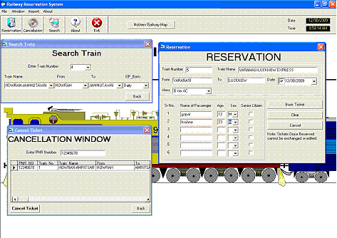



## Railway Reservation System

### Description

Reservation of railway tickets online.
 
### More Info
 
uesename : gopal

Password : krishna

all in small letters, no spaces

copy MS Access file Railway Reservation.mdb in a folder called "Railway" in E Drive!!

VB will ask for frmsplash.frm, it is in the same file, just add it!!

Tickets similar to actual ones.

             |
---                |---
**Submitted On**   |2009-12-26 19:19:34
**By**             |[Dbzgoku12](https://github.com/Planet-Source-Code/PSCIndex/blob/master/ByAuthor/dbzgoku12.md)
**Level**          |Beginner
**User Rating**    |4.3 (17 globes from 4 users)
**Compatibility**  |VB 6\.0
**Category**       |[Databases/ Data Access/ DAO/ ADO](https://github.com/Planet-Source-Code/PSCIndex/blob/master/ByCategory/databases-data-access-dao-ado__1-6.md)
**World**          |[Visual Basic](https://github.com/Planet-Source-Code/PSCIndex/blob/master/ByWorld/visual-basic.md)
**Archive File**   |[Railway\_Re21714012292009\.zip](https://github.com/Planet-Source-Code/dbzgoku12-railway-reservation-system__1-72778/archive/master.zip)

